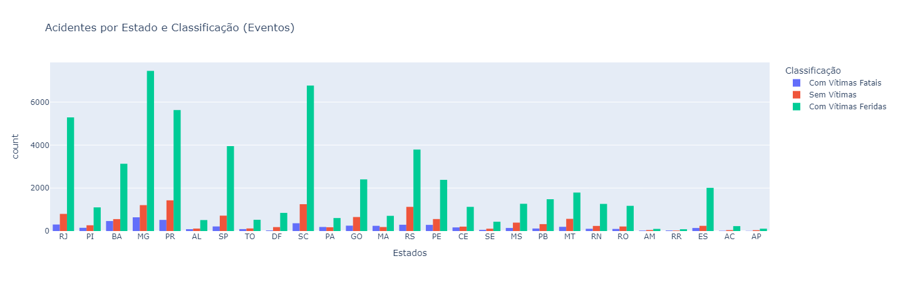

# Análise Acidentes de Trânsito nas Rodovias Federais

## Contexto:

[Brasil possui um trânsito extremamente violênto, com número de fatalidades que podem ser comparáveis aos homicídios intencionais](https://mundologistica.com.br/noticias/brasil-e-o-quinto-pais-com-transito-mais-perigoso-do-mundo#:~:text=O%20Brasil%20%C3%A9%20o%20quinto,cada%2010%20km%20de%20rodovias.)

Portanto, para melhor compreensão, extraí os [Dados da PRF dos acidentes de Trânsito de 2024 nas Rodovias Federais](https://www.gov.br/prf/pt-br/acesso-a-informacao/dados-abertos/dados-abertos-da-prf) e fiz algumas análises

## Objetivos:

- Utilizar o projeto como fonte de estudos e aprendizado, gerando melhorias e novas análises ao longo do tempo.

- Verificar se minhas análises condizem com as notícias sobre o Trânsito Brasileiro.

- Entender as aplicaçãos práticas dos conceitos de extração, manipulação e análise de dados com Python.

## Análises Realizadas:

### **1 - Estados com o maior número de Acidentes (eventos) e suas Classificações**

    | Posição |   Estado   | Quantidade | Percentil |
    |---------|------------|------------|-----------|
    | 01º     | MG         |      9296  |    12.71% |
    | 02º     | SC         |      8381  |    11.46% |
    | 03º     | PR         |      7576  |    10.36% |
    | 04º     | RJ         |      6389  |     8.73% |
    | 05º     | RS         |      5206  |     7.12% |
    | 06º     | SP         |      4883  |     6.67% |
    | 07º     | BA         |      4151  |     5.67% |
    | 08º     | GO         |      3305  |     4.52% |
    | 09º     | PE         |      3230  |     4.42% |
    | 10º     | MT         |      2554  |     3.49% |

## Possíveis Próximas Análises:

### **Tipos de Veículos que mais se acidentam**

### **Maiores Causas**

### **Por Sexo**

### **Por Faixa Etária**

### **Quantidade de mortos e feridos**

## Observações sobre a Base de Dados:

- Cada linha representa um registro de acidente por Vítima. Caso um carro com 4 passageiros e um condutor se acidente, são registrados 5 linhas na base de dados. Diversas colunas possuem os valores repetidos até chegar as informações pertinentes a vítima (como estado físico, idade, sexo e etc.)

- Para a análise da quantidade de acidentes e suas classificações, foi considerado somente 1 linha de cada evento e não por vítima.

### Pasta de Indicadores

Contém gráficos e tabelas gerados no projeto.
Indicadores antigos não mais utilizados no projeto principal se encontram dentro da pasta "antigos", assim como os códigos descontinuados do projeto principal.

## 🔗 Links Úteis e Estrutura: 
  
- [Dados Oficiais da PRF](https://www.gov.br/prf/pt-br/acesso-a-informacao/dados-abertos/dados-abertos-da-prf)

- [Documento CSV de Acidentes 2024 (Agrupados por pessoa - Todas as causas e tipos de acidentes)](https://drive.google.com/file/d/14qBOhrE1gioVtuXgxkCJ9kCA8YtUGXKA/view) **Utilizado no projeto**
 

/analise-acidentes-prf-2024/

├── /antigos # Arquivos descontinuados do projeto

    └── /indicadores # Antigos gráficos descontinuádos no projeto principal

├── /indicadores/ # Gráficos exportados do projeto principal

├── acidentes2024_todas_causas_tipos.zip # Dados brutos PRF

└── main.ipynb # Arquivo jupyter com todo o desenvolvimento

### Notícias:

[Agência Brasil - Acidentes em rodovias federais matam 6,16 mil pessoas em 2024](https://agenciabrasil.ebc.com.br/geral/noticia/2025-04/acidentes-em-rodovias-federais-matam-616-mil-pessoas-em-2024#:~:text=As%20unidades%20federativas%20que%20se,de%207%2C6%20mil%20sinistros.
)

[CNN Brasil - Acidentes em rodovias federais mataram mais de 16 pessoas por dia em 2024](https://www.cnnbrasil.com.br/nacional/brasil/acidentes-em-rodovias-federais-mataram-mais-de-16-pessoas-por-dia-em-2024/
)