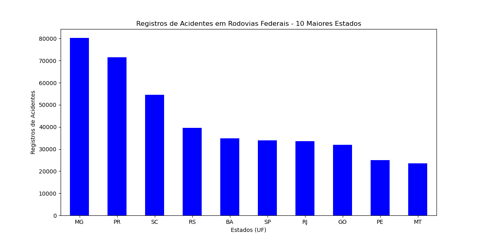
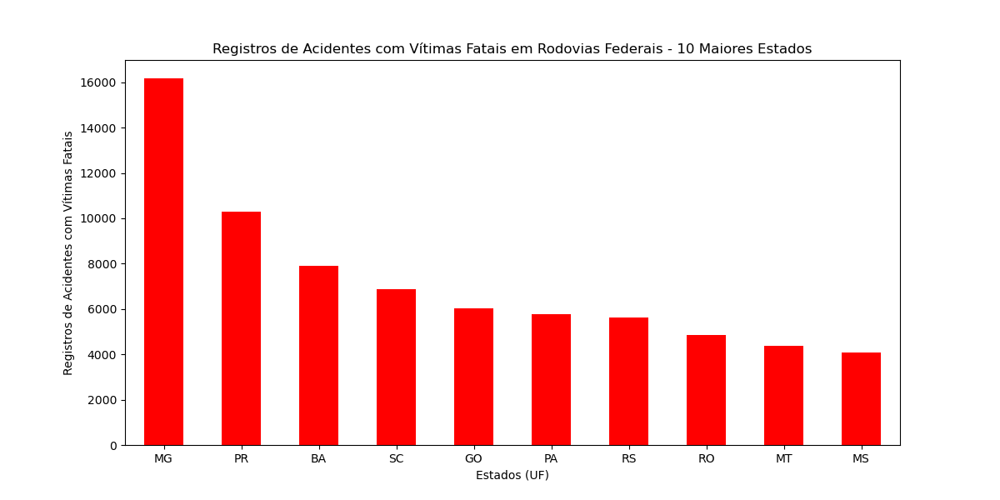
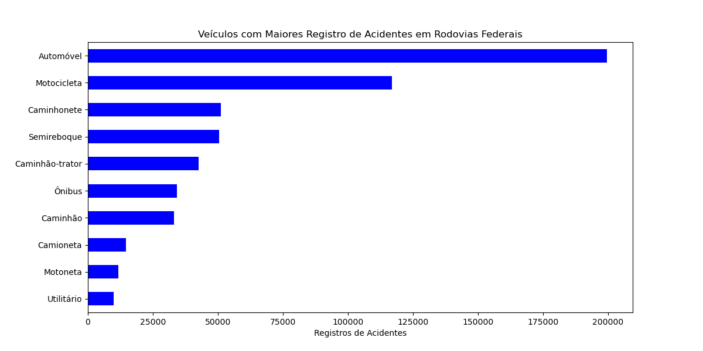
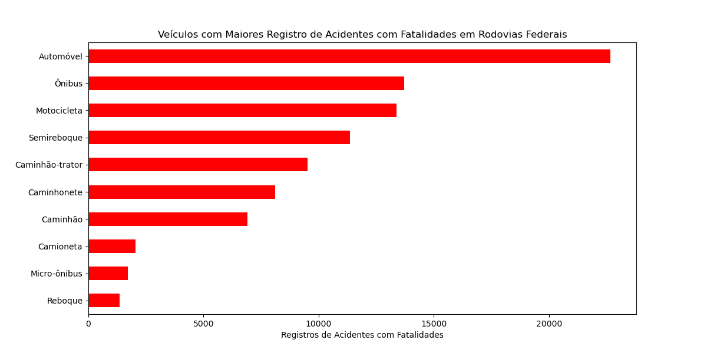

# Análise Acidentes de Trânsito nas Rodovias Federais

## Contexto:

[Brasil possui um trânsito extremamente violênto, com número de fatalidades que podem ser comparáveis aos homicídios intencionais](https://mundologistica.com.br/noticias/brasil-e-o-quinto-pais-com-transito-mais-perigoso-do-mundo#:~:text=O%20Brasil%20%C3%A9%20o%20quinto,cada%2010%20km%20de%20rodovias.)

Portanto, para melhor compreensão, extraí os [Dados da PRF dos acidentes de Trânsito de 2024 nas Rodovias Federais](https://www.gov.br/prf/pt-br/acesso-a-informacao/dados-abertos/dados-abertos-da-prf) e fiz algumas análises

## Objetivos:

- Utilizar o projeto como fonte de estudos e aprendizado, gerando melhorias e novas análises ao longo do tempo.

- Aplicar conceitos estudados e tentar responder as questões abaixo, criando indicadores.

- Verificar se minhas análises condizem com as notícias sobre o Trânsito Brasileiro.

- Entender as aplicaçãos práticas dos conceitos de extração, manipulação e análise de dados com Python.

## Perguntas e Respostas:

### **1 - Estados com o maior número de Registros de Acidentes**

    | Posição |   Estado   | Quantidade |
    |---------|------------|------------|
    | 01º     | MG         |     80257  |
    | 02º     | PR         |     71523  |
    | 03º     | SC         |     54459  |
    | 04º     | RS         |     39602  |
    | 05º     | BA         |     34879  |
    | 06º     | SP         |     33955  |
    | 07º     | RJ         |     33554  |
    | 08º     | GO         |     31927  |
    | 09º     | PE         |     24998  |
    | 10º     | MT         |     23581  |

### **2 - Estados mais Acidentes que contenham Vítimas Fatais**

    | Posição |   Estado   | Quantidade |
    |---------|------------|------------|
    | 01º     | MG         |     16175  |
    | 02º     | PR         |     10292  |
    | 03º     | BA         |      7901  |
    | 04º     | SC         |      6868  |
    | 05º     | GO         |      6046  |
    | 06º     | PA         |      5766  |
    | 07º     | RS         |      5614  |
    | 08º     | RO         |      4843  |
    | 09º     | MT         |      4361  |
    | 10º     | MS         |      4071  |

    Observação: O número de registros de acidentes não necessariamente reflete na quantidade de registros com vítimas fatais

### **3 - Tipos de Veículos que mais se envolvem em Acidentes**

    | Posição |   Tipo de Veículo   | Quantidade |
    |---------|---------------------|------------|
    | 01º     | Automóvel           |    199465  |
    | 02º     | Motocicleta         |    116917  |
    | 03º     | Caminhonete         |     51010  |
    | 04º     | Semireboque         |     50449  |
    | 05º     | Caminhão-trator     |     42464  |
    | 06º     | Ônibus              |     34244  |
    | 07º     | Caminhão            |     33134  |
    | 08º     | Camioneta           |     14649  |
    | 09º     | Motoneta            |     11745  |
    | 10º     | Utilitário          |      9813  |

### **4 - Veículos que possuem os maiores números de Acidentes com Vítimas Fatais**

    | Posição |   Tipo de Veículo   | Quantidade |
    |---------|---------------------|------------|
    | 01º     | Automóvel           |     22659  |
    | 02º     | Ônibus              |     13718  |
    | 03º     | Motocicleta         |     13374  |
    | 04º     | Semireboque         |     11370  |
    | 05º     | Caminhão-trator     |      9512  |
    | 06º     | Caminhonete         |      8113  |
    | 07º     | Caminhão            |      6904  |
    | 08º     | Camioneta           |      2036  |
    | 09º     | Micro-ônibus        |      1703  |
    | 10º     | Reboque             |      1367  |

## Próximas Análises:

### **5 - Maiores Causas de Acidentes por Estado**

### **6 - Maiores Causas de Acidentes com Vítimas Fatais por Estado ?**

### **7 - Sexo que mais se envolve em Acidentes**

### **8 - Sexo com a maior mortalidade em Acidentes**

### **9 - Registro de Acidentes por Faixa Etária**

### **10 - Registro de Vítimas Fatais por Faixa Etária**

## Roadmap de Melhorias:

1 - Gerar um único gráfico que contenham os valores totais de acidentes e fatalidades. O objetivo é facilitar a compreensão de quantos acidentes são convertidos em fatalidas e ter esse comparativo mais fácil e direto

2 - Adicionar as porcentagens para entender o impacto de cada ítem nos indicadores

3 - Sempre buscar indicadores que deixam as análises mais enchutas e que possam reduzir o tamanho da apresentação do projeto, mas sem deixar de responder nenhuma questão.

4 - Adicionar novas questões ao longo da elaboração do projeto

### Nota Metodológica
- Gráficos 1-2: Barras verticais (análise por estado)
- Gráficos 3-4: Barras horizontais (análise por veículo)
- Padrão de cores: 
  - 🔵 Azul = Total de acidentes
  - 🔴 Vermelho = Vítimas fatais

## Observações sobre a Qualidade dos Dados:

- Inconsistência em `mortos = 0` para acidentes fatais.  
- Valores como "Ileso" em registros de vítimas fatais.  
    - Decisão: Utilizar `classificacao_acidente` em vez de `mortos`

### Pasta de Indicadores

Contém gráficos e tabelas gerados para o projeto.
- Convenção de nomes:
  - `acidentes_por_[categoria].png`
  - `fatalidades_por_[categoria].png`
- Fonte dos dados: PRF (2024).

## 🔗 Links Úteis e Estrutura: 
  
- [Dados Oficiais da PRF](https://www.gov.br/prf/pt-br/acesso-a-informacao/dados-abertos/dados-abertos-da-prf)

- [Documento CSV de Acidentes 2024 (Agrupados por pessoa - Todas as causas e tipos de acidentes)](https://drive.google.com/file/d/14qBOhrE1gioVtuXgxkCJ9kCA8YtUGXKA/view) **Utilizado no projeto**

/analise-acidentes-prf-2024/

├── /indicadores/ # Gráficos exportados 

├── acidentes2024_todas_causas_tipos.csv # Dados brutos PRF

└── main.ipynb # Arquivo jupyter com todo o desenvolvimento